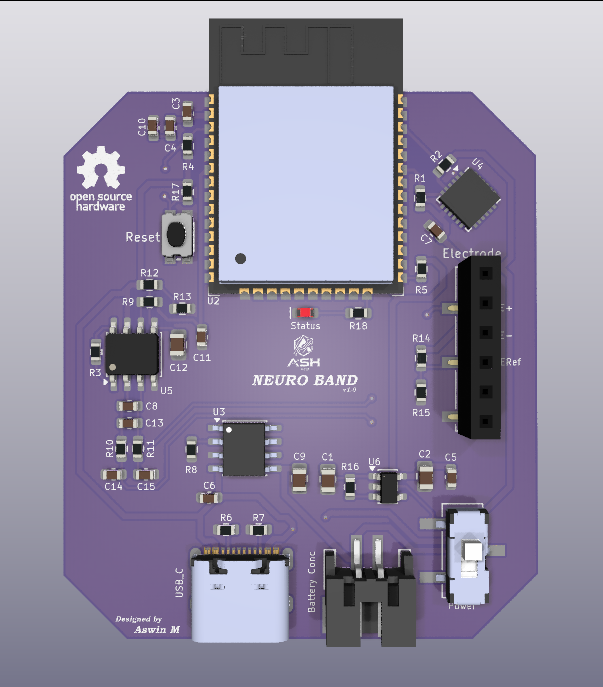
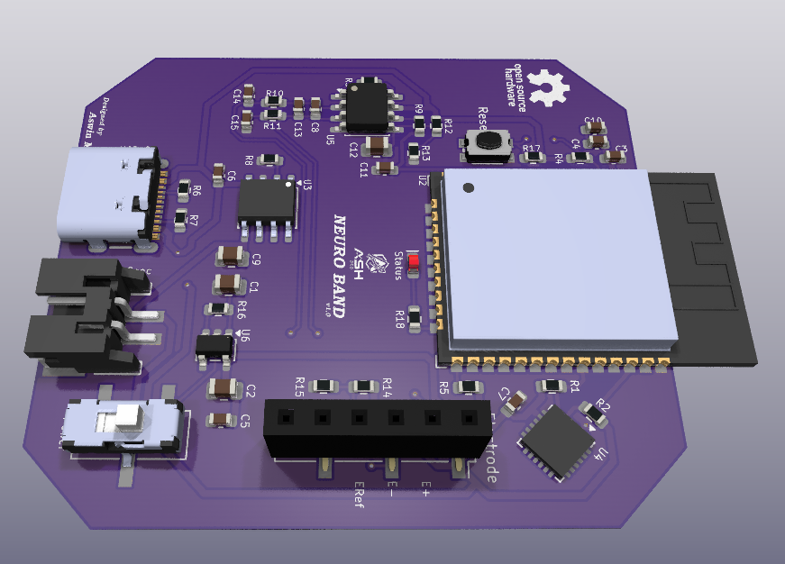

# Neuro-Band

Neuro-Band is an ESP32-based wearable device designed for neural signal acquisition and monitoring.  
The system integrates motion sensing, wireless communication, and low-power design for portable bio-signal applications.

## Hardware Features
- ESP32-WROOM-32E microcontroller
- LiPo battery with TP4056 charging
- 3.3V regulation using ME6211 LDO
- MPU6050 motion sensor
- Electrode interface for neural signal acquisition
- Compact 2-layer PCB design

## Repository Structure
- **3D/** – 3D models of components
- **Files/** – KiCad schematic and PCB files
- **Gerber/** – Manufacturing files for PCB fabrication
- **Images/** – PCB renders and layout images

## License
This project is licensed under the MIT License.

## PCB Preview
### Top Layer

### 3D View

